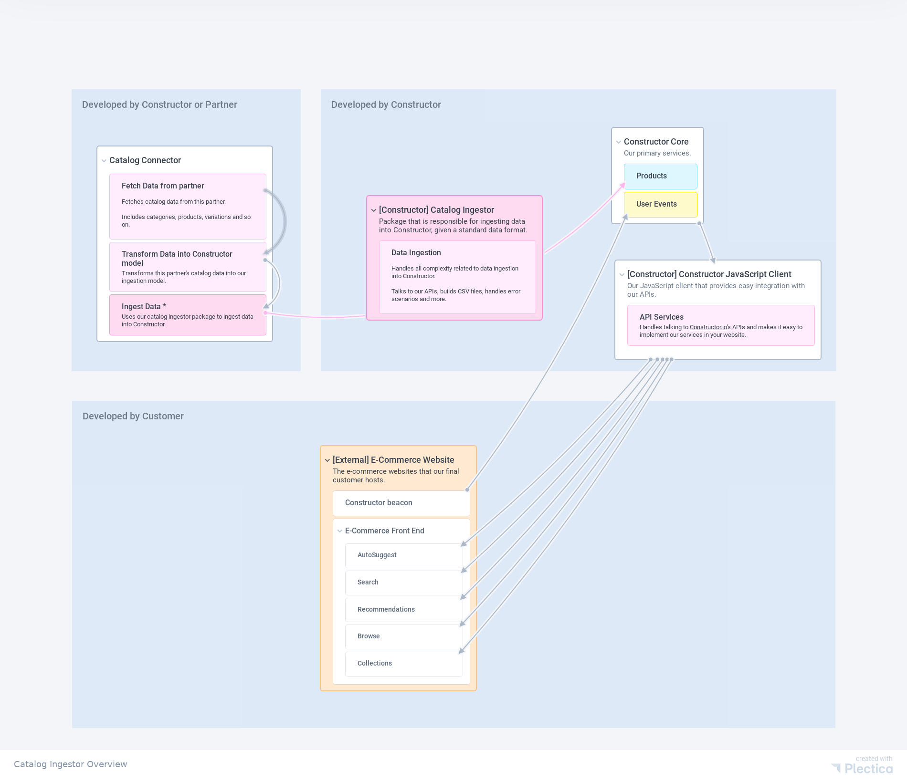

# Constructor.io Catalog Ingestor

[](https://www.npmjs.com/package/@constructor-io/catalog-ingestor)
[](https://github.com/Constructor-io/constructorio-catalog-ingestor/blob/master/LICENSE)
[](https://bundlephobia.com/result?p=@constructor-io/catalog-ingestor)

A Node.js library for easily ingesting product catalogs into Constructor.io, using a strict type system.

> This client is intended for use in server side integrations. If you want a JavaScript client for client side (i.e. front end) integrations please use [@constructor-io/constructorio-client-javascript](https://github.com/Constructor-io/constructorio-client-javascript)

## Architecture overview

Here's how the `@constructor-io/catalog-ingestor` package usually fits into the overall ecosystem:



## Description

This package is meant to help in the process of ingesting your catalog data into Constructor.io. Internally, it relies on our [public API](https://docs.constructor.io/).

## Installation

First, install the package:

```bash
npm i @constructor/ingestor
```

## Usage

To ingest data, you simply need to call the `ingest` method:

```ts
import {
  CatalogIngestionPayload,
  CatalogIngestionType,
  CatalogIngestor
} from "@constructor-io/catalog-ingestor";

async function fetchData(): Promise<ExternalData> {
  // TODO: Implement your logic to fetch data here.

  return {};
}

function transformData(data: ExternalData): CatalogIngestionPayload {
  // TODO: Implement your logic to transform data here.
  // Here, we're just using an example dataset.

  return {
    type: CatalogIngestionType.FULL,
    data: {
      groups: [
        {
          parent_id: null,
          name: "Shoes",
          id: "shoes",
        },
      ],
      items: [
        {
          id: "nike-shoes-brown",
          item_name: "Nike Shoes Brown",
          image_url: "https://images.nike.com/shoes-brown.jpg",
          url: "https://www.nike.com/shoes-brown",
          description: "Best shoes",
          group_ids: ["shoes"],
          active: true,
          metadata: [],
          keywords: [],
          facets: [
            {
              key: "Color",
              value: "Brown",
            },
            {
              key: "Size",
              value: ["M", "L", "XL"],
            },
          ],
        },
      ],
      variations: [],
    },
  };
}

const catalogIngestor = new CatalogIngestor({
  apiToken: "my-constructor-api-token",
  apiKey: "my-constructor-api-key",
  connectionId: "my-connection-id",
});

await catalogIngestor.ingest(async () => {
  const data = await fetchData();
  return transformData(data);
});
```
